# Laranode - Open-Source Hosting Control Panel

Laranode is a simple but powerful open-source alternative to cPanel and Plesk, designed to simplify VPS and dedicated server management. With an intuitive interface and robust features, Laranode makes it easy to deploy and manage websites, databases, SSL certificates, and more.

## Features

✅ **Self-Hosted** – Full control over your server with NO licensing fees.

✅ **Multi-Account Support** – Role-based access control for admins and users.  

✅ **Website Management** – Easily create and manage multiple websites.  

✅ **SSL with Let's Encrypt** – Secure your websites with free SSL certificates with a click of a button.

✅ **File Manager** – Built-in (from the ground up) web-based file manager for quick access.  

✅ **Live System Stats** – Monitor CPU, memory, and network usage in real-time. 

✅ **LAMP Stack Administration** – Manage Apache, MySQL, and PHP with ease.  

✅ **User-Friendly Interface** – Clean and simple UI designed for efficiency.  

✅ **MySQL Database Management** – Create and control MySQL databases.  

✅ **UFW Firewall** – Manage uncomplicated firewall rules with ease directly from the web interface.  

## Installation

Laranode can be installed on a FRESH VPS or dedicated server.

### Min. Requirements
- Ubuntu 24.04+
- 1vCPU
- 2GB RAM
- 10GB Disk Space

### Quick Install
```bash
curl -sSL https://raw.githubusercontent.com/crivion/laranode/refs/heads/main/laranode-scripts/bin/laranode-installer.sh | bash
```

## Getting Started
Once installed, access Laranode via your browser:
```
http://your-server-ip
OR if you pointed your domain/subdomain
http://your-domain.tld
```
Login with the credentials provided during installation.

## Screenshots

| Light | Dark |
|:------:|:----:|
| 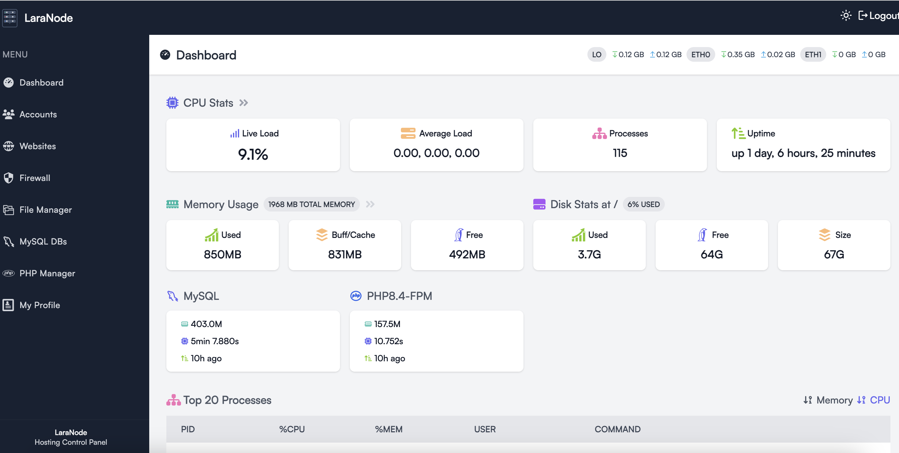 | 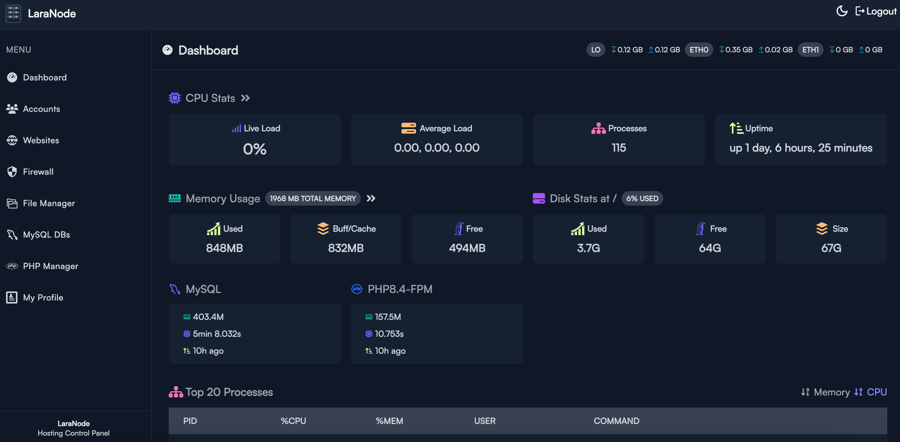 |
| 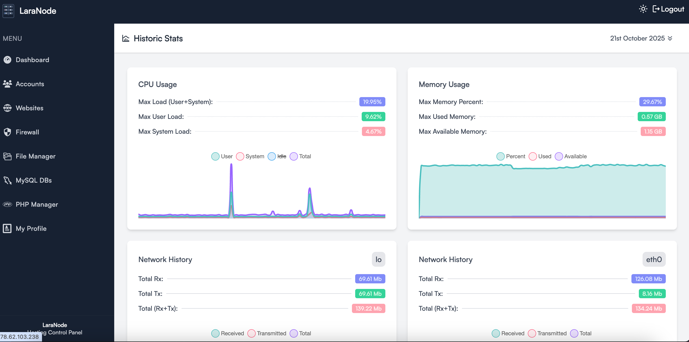 | 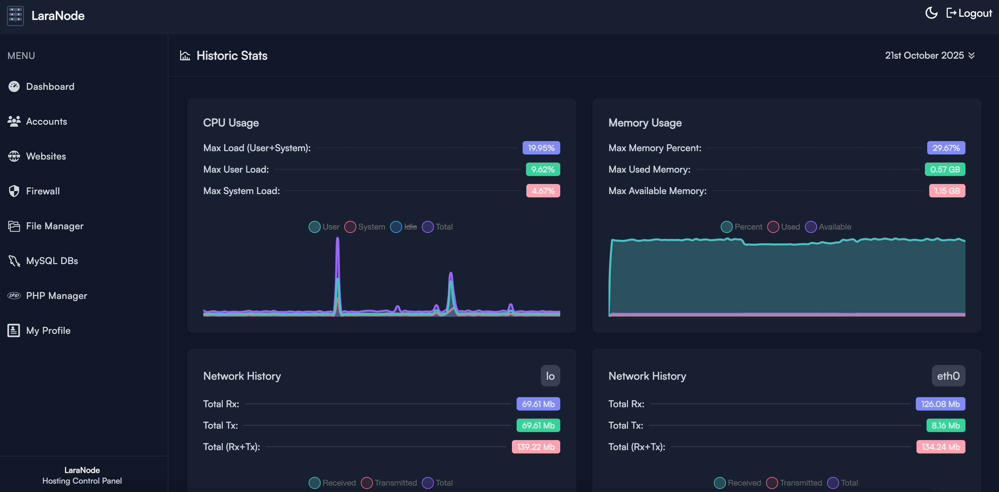 |
| 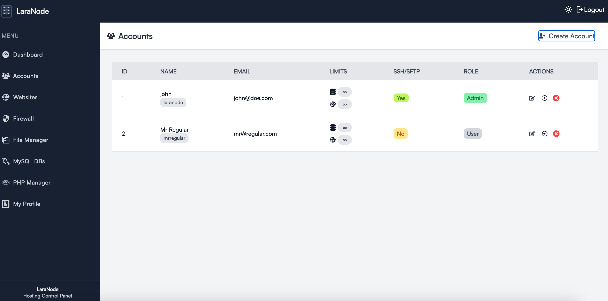 | 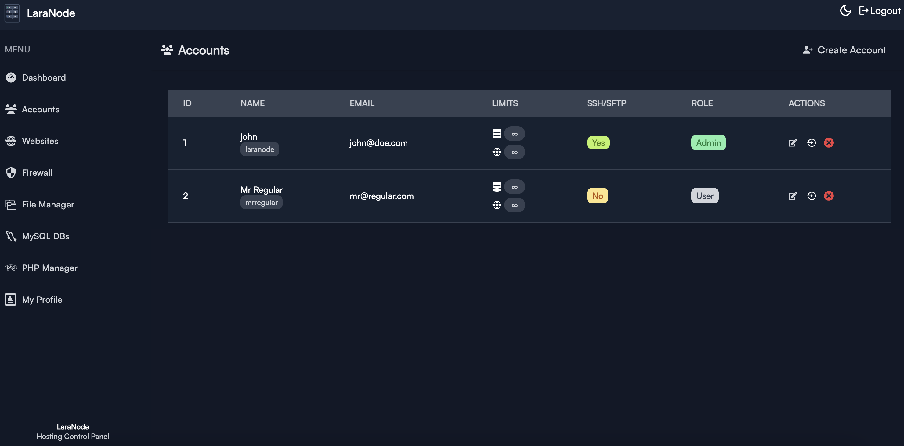 |
| 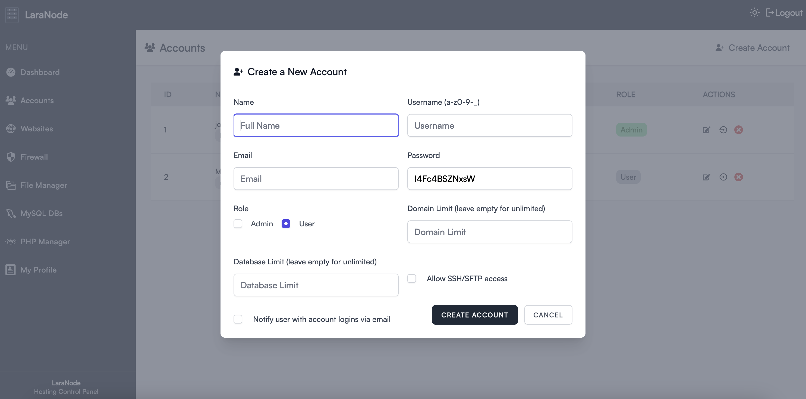 | 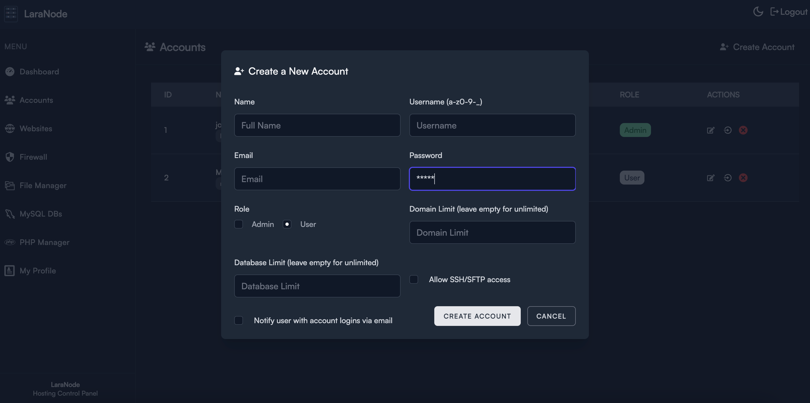 |
| 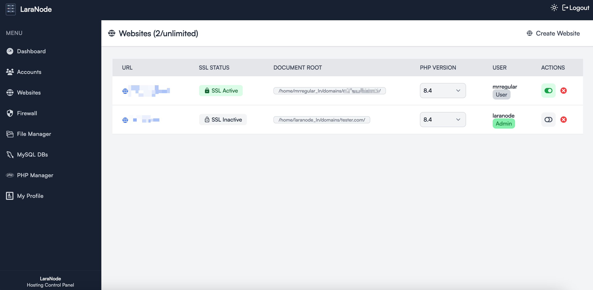 | 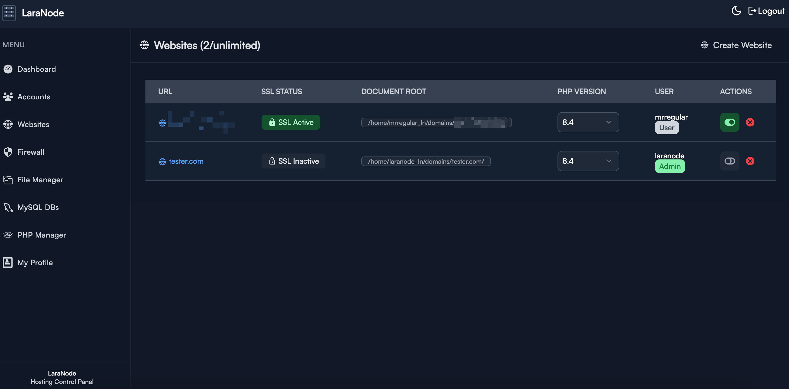 |
| 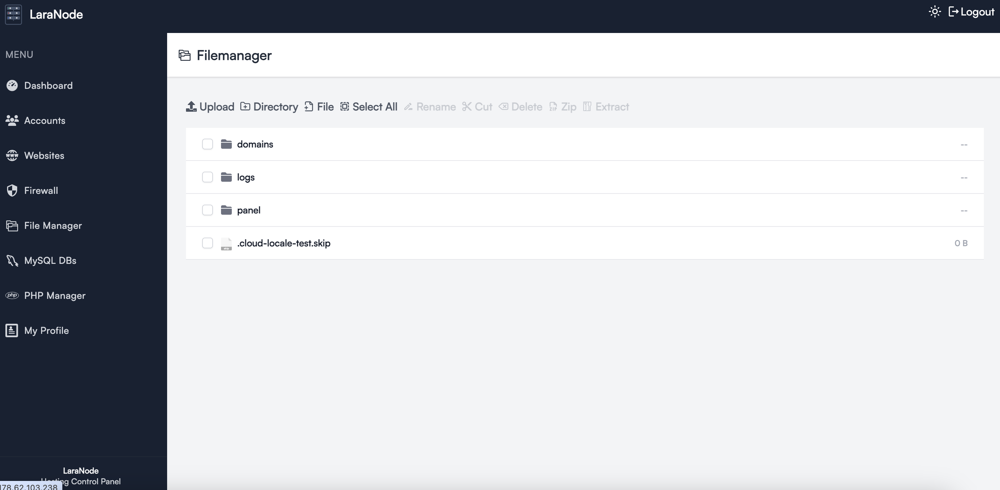 | 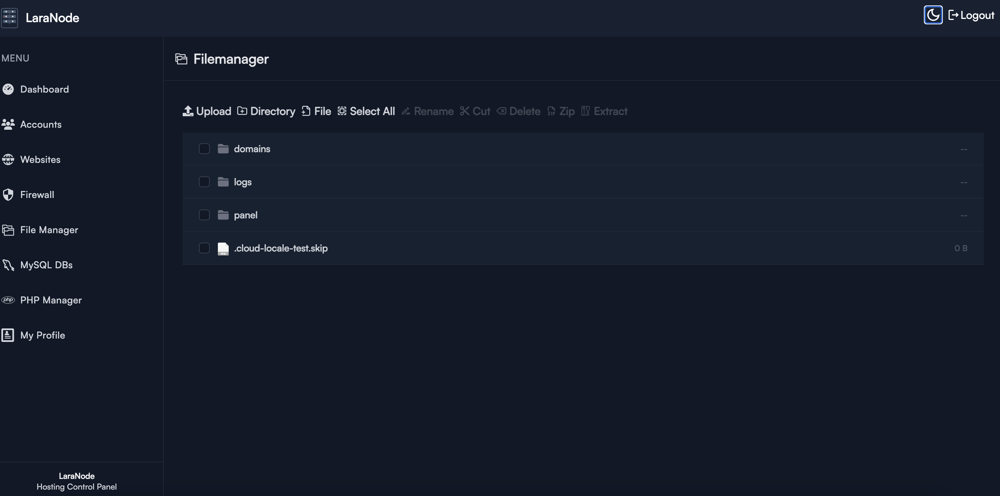 |
| 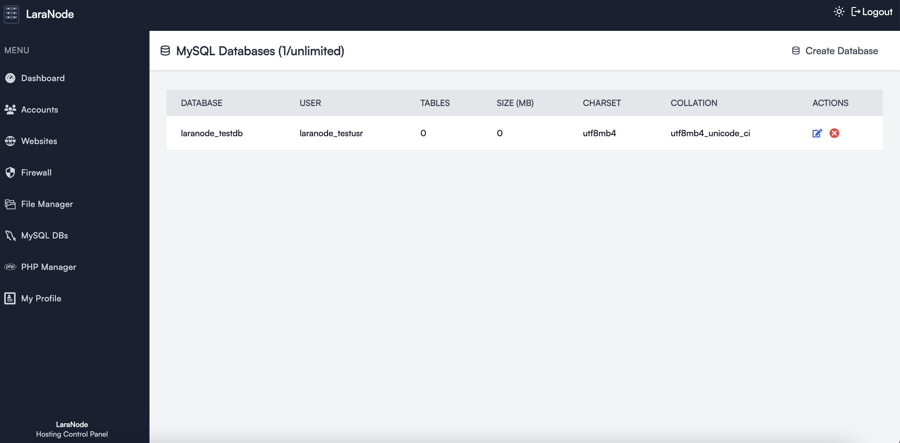 | 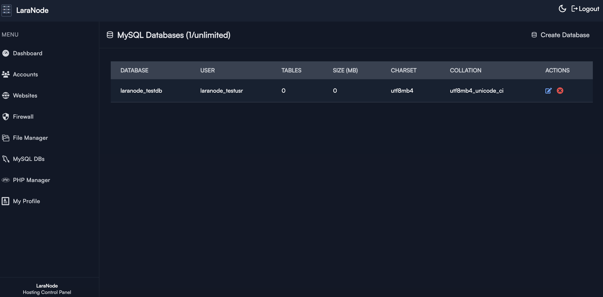 |
| 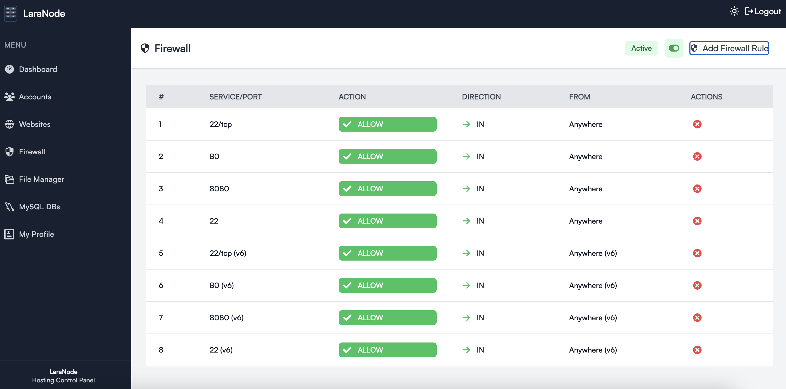 | 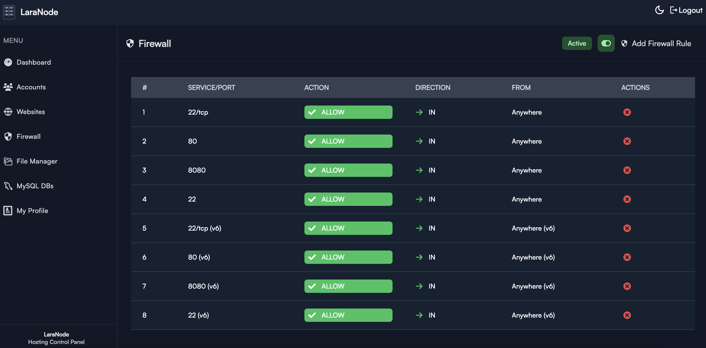 |

## Minimum Requirements


## 1-Click Deployment with DigitalOcean
[](https://marketplace.digitalocean.com/apps/laranode-panel?refcode=833110c66c2c&action=deploy)

## Roadmap - Future Release Plans

- 🔹 PHP Manager - install, update, remove PHP versions
- 🔹 Backup Manager - backup websites, databases, and files

## Contributing
Laranode is open-source and welcomes contributions! Feel free to submit issues, feature requests, or pull requests.

## License
Laranode is open-source and released under the [MIT license](https://opensource.org/licenses/MIT).
---

⭐ **Star this repo to support the project!**
